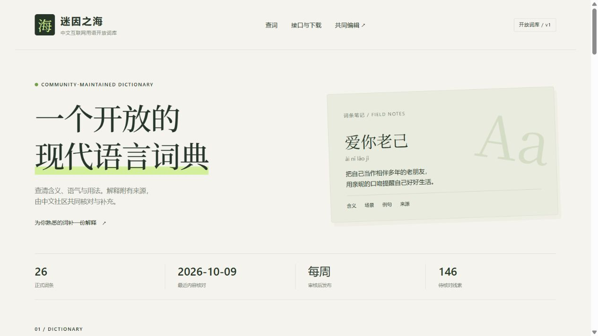

# 迷因之海 · Lans Sea

社区维护的中文互联网用语词库，供用户、AI 和应用查阅。第一版提供中文释义、语境、原创例句、核验来源、精确查询与整库下载。

首批 23 条由旧库逐条校订而来，**不是当前热榜**。`reviewed_at` 是内容核对日期，未知起源用 `first_seen: null` 表示。详见 [词条来源核对](docs/content-research.md)。

2026-10-09 补入「爱你老己」「活人感」「从夯到拉」，共 26 条正式词条；首页与接口演示改用「爱你老己」。本次采用 2025—2026 年的公开报道与平台用例，见 [近期词条来源核对](docs/content-refresh-2026-10.md)。



## 本地使用

需要 Node.js 20 或以上；核心代码、构建、采集和测试均没有 npm 依赖。

```sh
npm start
```

打开 `http://127.0.0.1:8000`。服务启动时构建词库；编辑内容后重启即可。改端口可以设置 `PORT` 环境变量。

```sh
# 精确查词（term 必须是正式词名；中文参数请 URL 编码）
curl 'http://127.0.0.1:8000/api/v1/lookup?term=%E5%86%85%E5%8D%B7'
# 下载整库
curl 'http://127.0.0.1:8000/api/v1/all.json'
# 构建和校验
npm run check
```

API v1 暂不匹配别名、错字或近似词。网页支持浏览器内搜索。完整契约和静态调用方式见 [接口文档](docs/api.md)，后续功能见 [TODO](TODO.md)。

## 数据与社区流程

1. 每日采集 B站、微博、抖音的公开标题和链接，进入候选队列；社区也可在网页填写、预览词条，再到 GitHub 确认提交 Issue。
2. 贡献者用自己的话编写中文释义、语境与例句，尽量附可核验来源。
3. 维护者通常每周集中审核 PR。核对通过后设为 `published`，合并即发布；没有审核的内容继续留在队列。

采集器不生成释义、不自动发布、不关闭 Issue。热榜搜索页和热点页只是线索，不能冒充原始出处。构建会阻止缺少来源的正式条目；无来源贡献先保留待审，社区核对后再发布。[贡献指南](CONTRIBUTING.md)

网页提词支持本机草稿保存、来源链接校验和提交前预览。每个词条详情下已接入 giscus 讨论区，按固定词条 ID 区分讨论；当前绑定本仓库的 Announcements 分类。操作说明见 [网页提词与讨论区](docs/community.md)。

```sh
node scripts/collect.mjs --dry-run
npm run collect
```

候选按平台与 ID 去重累积，保留首次/最近发现时间和人工审核字段。来源独立超时；全失败保留既有队列、写失败状态并退出 1；部分成功保存成功来源。平台接口可能变化或限流，运行结果见 `data/collection-status.json`。

GitHub 定时任务先合并已有机器人分支的线索，再更新同一个 `codex/candidates` PR，未合并时仍能积累。合并候选 PR **只保存线索**；正式收录必须另修改 `data/entries.json`。不会依赖公共聚合 API 实例。

## 零费用部署

### A. GitHub Pages：网页、索引、单条与整库 JSON

推送到自己的 `main` 后，在仓库 **Settings → Pages → Source** 选择 **GitHub Actions**。`Publish reviewed dictionary` workflow 会校验并直接部署 `dist/`，无需 npm install。

项目默认地址为 `https://Roelatriper.github.io/lans-sea/`，这是部署目标地址，不表示已经上线。网页所有资源使用相对路径，兼容项目子目录。

Pages 是静态服务，不运行 `lookup?term=…`。调用者先读 `/api/v1/index.json`，找到词条 ID，再读 `/api/v1/entries/<id>.json`，也可以一次下载 `all.json`。浏览器跨域 GET 请在上线后实际验收。

如需定时生成候选 PR，在 **Settings → Actions → General → Workflow permissions** 启用读写权限以及 **Allow GitHub Actions to create and approve pull requests**。工作流不会自动批准或合并 PR。Fork 的 schedule 需在 Actions 中启用；可手动运行 `Collect candidate clues`。

建议给 `main` 设置保护规则：要求 PR、维护者审核和 `check` 校验。`CODEOWNERS` 只负责请求审核，单独存在不强制阻止合并。普通 fork PR 的检查只读取内容，不获得写入 token。

### B. Cloudflare Workers Free：增加直接查询

```sh
npm run build
npx wrangler deploy
```

已有 `wrangler.jsonc`、静态 assets 与 Worker；命令会下载 Wrangler 并要求登录自己的 Cloudflare 账号。可使用 `workers.dev` 默认域名，无需买域名。建议保留 Free 计划；本仓库没有创建账号、上传或开通付费服务。

Worker 从同一份部署资产查词，不依赖实时 GitHub 请求，也不需要数据库。每次词库更新后重新执行 build/deploy。免费动态调用目前限账号每天 10 万次，超限报错；静态整库可继续通过 GitHub Pages 分发。具体服务约束和 primary sources 见 [技术调查](docs/research.md)。

## 仓库结构

```text
data/entries.json          中文正式词条与人工候选
data/candidates.json       自动发现的原始线索
src/dictionary.mjs         校验、精确查询与接口响应
web/                       中文网页脚本与样式
scripts/build.mjs          从同一词库生成 dist/
scripts/serve.mjs          本地网页与查询接口
scripts/collect.mjs        三个平台的独立采集器
worker/index.js            可选 Cloudflare 查询服务
.github/                   校验、采集 PR、Pages 部署及贡献表单
docs/                      接口、来源与已有项目调查
```

`data/memes.json` 是原项目的历史备份，包含未经重新核验的外语内容。新网站和接口不读取它。删除了损坏的 Python 更新脚本与旧 workflow，避免继续生成模板释义或操作原作者的 Issue。

## 验证与边界

`npm run check` 校验词条并运行精确查询、错误响应、Worker 和采集器测试。采集测试注入离线响应，涵盖来源解析、临时 cookie、增量去重、超时、部分失败、全失败与写入保护。

实际验证和线上待验收项见 [第一版验证记录](docs/verification.md)。

## 感谢

感谢原作者 [WenKanghwdd](https://github.com/WenKanghwdd/china-meme-dictionary)、[DailyHotApi](https://github.com/imsyy/DailyHotApi)、[NewsNow](https://github.com/newsnext/newsnow)、[giscus](https://github.com/giscus/giscus-component)、[create-pull-request](https://github.com/peter-evans/create-pull-request) 的公开实现与社区贡献者；本项目保留 MIT 许可证。
