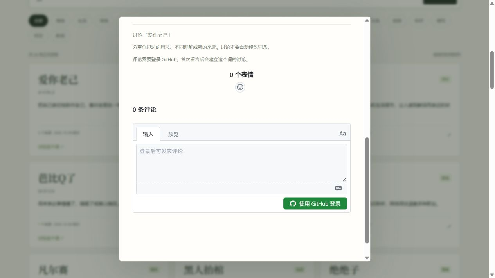
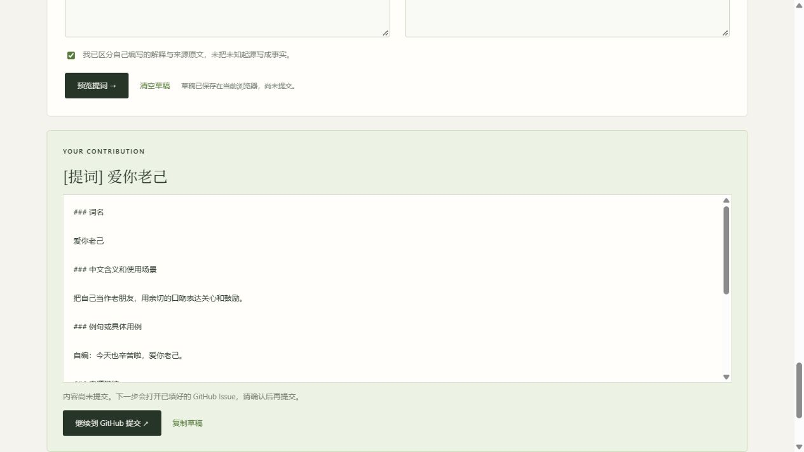

# 第一版验证记录

完成日期：2026-10-09（Asia/Hong_Kong）。内容核对与首次采集在 2026-10-08 完成。

## 网页提词、讨论区与改名（2026-10-10）

- 产品中文名改为「迷因之海」，仓库为 `Roelatriper/lans-sea`，本地远程、网页链接、Pages 示例与 Worker 提词入口同步更新。
- `npm run check`：21 项通过，新增提词校验、中文 URL、长草稿复制兜底与固定词条 ID 讨论映射测试。
- 桌面浏览器验证来源协议错误提示、预览与 GitHub Issue 参数、刷新恢复草稿、确认框不自动勾选和清空草稿。未在真实仓库提交测试 Issue。
- 使用管理员提供的 repoId 和 Announcements 分类 ID 启用 giscus。实际加载出「0 条评论」与 GitHub 登录按钮；爱你老己、活人感使用不同的严格匹配标识。未登录或发布测试评论，因此 OAuth 完整往返与首次建讨论仍待验收。
- 当前浏览器的视口设置未实际生效（请求 390px 后仍为 1280px），本轮手机布局未完成实测；保留响应式单列表单样式，后续需在手机验收。
- GitHub API 确认新仓库 Issues 与 Discussions 已开启。修改通过功能分支和 PR 提交，main 保护规则继续生效。

## 首页与近期词条更新（2026-10-09）

- 正式词库补入爱你老己、活人感、从夯到拉，共 26 条；来源与证据限度见 [本轮核对](content-refresh-2026-10.md)。
- `npm run check` 的 17 项测试通过；构建成功导出新词条及来源。
- 浏览器确认主标题为「一个开放的现代语言词典」，三条新词位于列表前部，接口演示返回爱你老己，详情显示两个核对来源。
- 桌面与 390px 手机预览中标题完整、无横向溢出；已更新 README 的首页截图。本地服务已重启以读取新词库。

## 已完成

- `npm run check`：17 项测试通过，涵盖来源解析、增量累积、临时 cookie、超时、失败保护、精确查询、来源门槛、Worker 响应、索引与单条导出，以及从发布数据移除词条时旧文件清理。
- 真正公网采集：B站 50、微博 50、抖音 46，共 146 条，保存来源 URL 和发现时间；三源成功。没有生成释义或自动转为正式词条。
- 实际本地 HTTP：整库、索引、单条、精确命中返回 200；未知词返回 404；缺少参数返回 400；响应包含 JSON 类型和跨域头；前端模块可读取。
- 浏览器：23 条加载、中文搜索、无声调拼音搜索、词条弹窗、例句与来源、关闭后焦点恢复、无结果提词入口、精确演示的 `not_found`；控制台没有错误。
- 手机布局：390×844 视口下 23 张词条卡片正常布局，没有水平溢出；测试结束恢复默认视口。
- Cloudflare：`wrangler deploy --dry-run` 成功打包，识别 ASSETS binding；没有登录账号或上传服务。
- `git diff --check`：通过。
- 使用临时 js-yaml CLI 解析 5 个 workflow 与 Issue 表单：通过，未添加项目依赖。

## 尚未线上验收

- GitHub Pages 的实际部署、跨域响应和项目子路径访问。构建使用相对资源路径，现阶段已检查产物；没有把本地验证描述成线上验证。
- GitHub 定时任务的 runner 可达性、仓库创建 PR 权限与保护规则。工作流需推送并按 README 启用。
- Cloudflare 实际账号部署、免费计划负载。可选 Worker 已本地打包验证，但未上线。
- 对词义和来源的社区复核仍持续进行。首批词条来源和证据限制见 content-research.md。

本地预览使用 `http://127.0.0.1:8001/`；正常重启可用 `npm start`，默认端口 8000。
